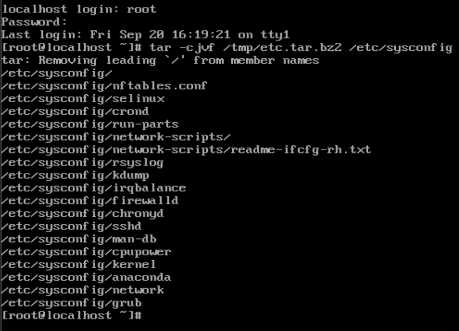

# centos-admin-tasks
Linux administration project using CentOS

## 🧾 Command Usage & Scripting
Basic system commands and automation examples.

## 👥 User & Group Management
Managing users, groups, and permissions.

## 🔐 File Permission & Access Control
Working with chmod, chown, sticky bit, and more.

