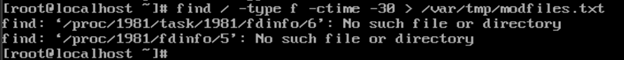
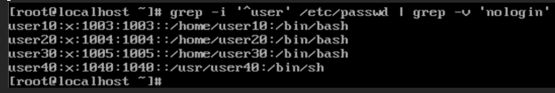

# 🖥️ CentOS System Administration Lab

This project demonstrates foundational Linux system administration tasks performed in a CentOS environment using the terminal. The tasks are grouped by topic and include real screenshots from lab assignments.

---

## 📂 Command Usage & Scripting

Examples of using system commands and scripts to manage files and system behavior:

- `tar` and `bzip2` to compress files  
  

- Finding and modifying files in `/var/tmp`  
  

- `grep` for users who do not use `/sbin/nologin`  
  

---

## 👥 User & Group Management

Directory created and reserved for screenshots demonstrating:

- `useradd`, `groupadd`, `passwd`
- User switching (`su`) and login shell management
- Locking/unlocking user accounts

---

## 🔐 File Permissions & Access Control

Directory reserved for screenshots demonstrating:

- `chmod`, `chown`, and `chgrp`
- Special permissions (sticky bit, setgid)
- Ownership and access control

---

## 🧠 Skills Demonstrated

- Linux terminal navigation
- User and group administration
- File permissions and access control
- Bash scripting and command usage
- Documentation through screenshots
- Project organization in GitHub

---

## 💼 About This Project

This repo showcases practical Linux admin knowledge, as gained through real lab work. It is intended as a technical portfolio to demonstrate system-level command experience and GitHub proficiency.
